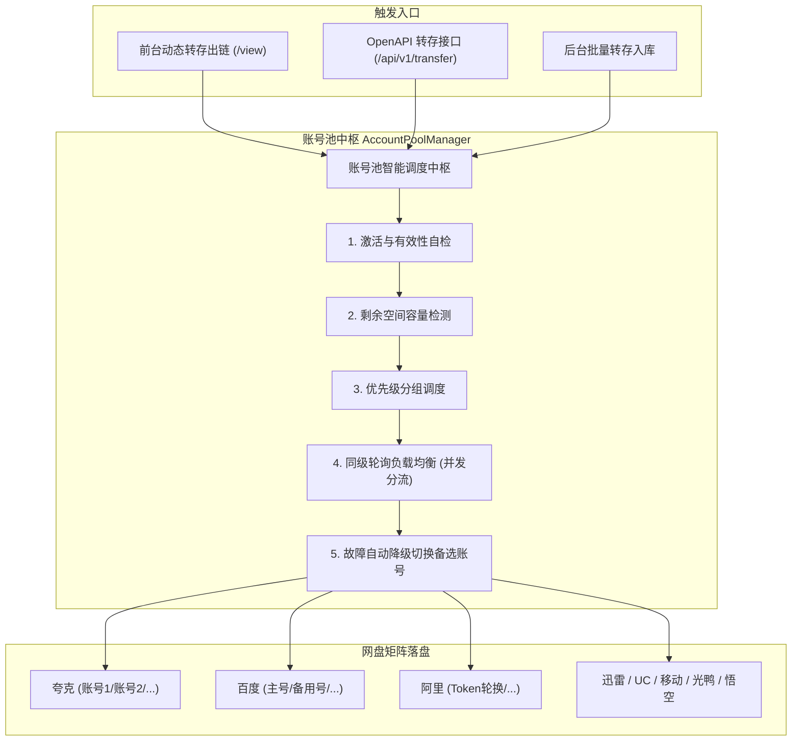

<div align="center">


**基于 Python 的多网盘聚合中继、多账号池调度与自动化变现管理系统**

[](LICENSE) [](https://www.python.org/) [](https://flask.palletsprojects.com/) [](https://www.sqlite.org/) [](#-部署指南) [](#-开放-rest-api-与无头部署) [](#-网盘多账号池体系) [](#-支持的网盘矩阵)

<p align="center">
  <a href="#-核心业务逻辑">业务逻辑</a> •
  <a href="#-网盘多账号池体系">多账号池</a> •
  <a href="#-支持的网盘矩阵">支持网盘</a> •
  <a href="#-网盘凭据快速配置">凭据配置</a> •
  <a href="#-部署指南">部署指南</a> •
  <a href="#-开放-rest-api-与无头部署">开放 API</a> •
  <a href="#-联系作者">联系作者</a>
</p>

Pan-Relay 是一款专为网盘推广员、资源站长打造的**全自动化收益与聚合分发系统**。

通过“资源聚合 → 智能号池调度 → 自动转存 → 换链变现 → 优先分发”全链路闭环，将全网外部公开资源高效转换为您的专属收益链接，成倍放大拉新与转存收益。

**支持本地资源库、第三方 API、Telegram 公开频道与可扩展 Python 插件聚合搜索。支持完全解耦的开放 REST API 与微信小程序、Flutter / React Native APP 快速无缝对接。**

</div>

---

## 💎 核心业务逻辑

### 🔄 变现与转存闭环流程

* **企业级多账号池调度**：已接入**夸克网盘、百度网盘、阿里云盘、UC网盘、迅雷网盘、光鸭云盘、悟空网盘、移动云盘** 8 大主流网盘，每个网盘支持无限添加子账号并执行负载均衡。
* **自动化转存换链**：
  * **模式一：批量转存 (入库)**：后台批量导入外部链接，自动“多号分流转存 $\rightarrow$ 换链 $\rightarrow$ 持久化入库”，构建站长私有核心收益资源库。
  * **模式二：实时转存 (出链)**：前台或 API 搜索外部资源时按需实时调用账号池转存并生成收益链接返回给用户，过期由系统定时任务自动清理释放网盘空间。
* **私有收益资源库**：资源统一存入本地 SQLite 数据库，支持后台批量导入、转存、增删改查、类型标注、精准账号关联与 Excel 导出。
* **多渠道聚合搜索**：
  * **前台搜索**：优先展示私有资源库中的收益链接，再并发聚合第三方 API、Telegram 公开频道和搜索插件的结果。
  * **两步走 REST API**：提供规范的 `/api/v1` REST 接口（步骤 1 聚合查询 / SSE 流式推流 -> 步骤 2 自动转存替换），便于无缝对接移动端 APP、小程序或 Telegram 机器人。

> 📖 关于 API 接口源 JMESPath 字段映射、TG 频道免密抓取与编写 Python 搜索插件，详见 [搜索源体系与插件扩展指南](docs/plugins_and_sources_guide.md)。

---

## ✨ 项目核心亮点

* **网盘多账号池中枢**：同网盘多账号优先级管理、容量自动检测熔断、加权轮询并发分流、故障自动转移降级与后台静默保活。
* **8大网盘能力全覆盖**：全量支持目录自动归档、上游垃圾广告文件智能过滤、以及专属引流文件自动植入。
* **前后端完全解耦**：前台搜索界面与开放 API 服务完全解耦，可按需独立启闭，支持作为纯后端中转服务运行（无头模式）。
* **开箱即用**：内置 SQLite 数据库，启动时自动初始化表结构及预置 10+ API、115+ TG 频道和 26+ 插件搜索源，支持 Docker 一键拉起。
* **免凭证TG搜索**：直接抓取 Telegram 公开频道预览，无需 Bot Token，自动提取网盘链接与提取码。
* **免登录链接实时测活**：搜索结果自动异步免登录探测死链与失效状态，大幅降低无效请求与风控概率。
* **容器化部署**：提供标准 Dockerfile 与 Docker Compose，支持数据持久化和健康检查。

---

## 👥 网盘多账号池体系

系统内置了独立的 **`AccountPoolManager`（网盘多账号池调度器）**，实现跨平台、多账号的统一自治管理：



---

## 💾 支持的网盘矩阵

| &emsp;&emsp;网盘平台&emsp;&emsp; | 自动转存 | 号池调度 | 链接测活 | 凭据保活 | 容量熔断 | 广告净化 | 引流植入 | 过期清理 |
| :--- | :---: | :---: | :---: | :---: | :---: | :---: | :---: | :---: |
| **夸克网盘** | ✓ | ✓ | ✓ | - | ✓ | ✓ | ✓ | ✓ |
| **UC 网盘** | ✓ | ✓ | ✓ | - | ✓ | ✓ | ✓ | ✓ |
| **百度网盘** | ✓ | ✓ | ✓ | - | ✓ | ✓ | ✓ | ✓ |
| **阿里云盘** | ✓ | ✓ | ✓ | ✓ | ✓ | ✓ | ✓ | ✓ |
| **迅雷网盘** | ✓ | ✓ | ✓ | ✓ | ✓ | ✓ | ✓ | ✓ |
| **光鸭云盘** | ✓ | ✓ | ✓ | ✓ | ✓ | ✓ | ✓ | ✓ |
| **移动云盘** | ✓ | ✓ | ✓ | ✓ | - | ✓ | ✓ | ✓ |
| **悟空网盘** | ✓ | ✓ | ✓ | - | - | ✓ | ✓ | ✓ |
| **123 云盘** | - | - | ✓ | - | - | - | - | - |
| **115 网盘** | - | - | ✓ | - | - | - | - | - |
| **天翼云盘** | - | - | ✓ | - | - | - | - | - |
| **联通云盘** | - | - | ✓ | - | - | - | - | - |

---

## ⚙️ 网盘凭据快速配置

登录管理后台（`/admin`）进入 **系统配置 → 网盘账号池** 点击 **【+ 添加账号】** 即可配置各网盘登录态：

* **夸克 / 百度 / UC网盘**：登录网页版，从浏览器开发者工具（`F12`）网络请求标头中复制完整 `Cookie` 填入。
* **阿里云盘**：从登录会话本地存储（Local Storage）中提取并填入 `refresh_token`。
* **迅雷网盘**：
  * **一键提取（推荐，支持 Win / Mac / Linux）**：电脑登录官方迅雷客户端后，在项目根目录运行 `python3 scripts/extract_xunlei_token.py` 即可自动读取并导出。
  * **手动配置**：填入提取的 JSON 凭证或移动端抓包获取的 `refresh_token`。
* **光鸭云盘**：登录网页版提取 `access_token` 或填入 `refresh_token` 凭证。
* **悟空网盘**：从网页端开发者工具中复制网络请求标头中的 `Cookie` 或 Token。
* **移动云盘**：登录 `yun.139.com` 网页版，从请求标头中复制 `Authorization`。

> 📖 详细的多账号配置步骤、完整抓包图文教程与故障自愈机制，详见 [网盘多账号池配置指南](docs/account_pool_guide.md)。

---

## 🚀 部署指南

### 方式一：Docker 部署（强烈推荐，开箱即用）

内置 SQLite 数据库，无需安装任何外部数据库软件，一键拉起：

```bash
# 1. 克隆代码并进入目录
git clone https://github.com/ucmao/pan-relay.git
cd pan-relay

# 2. 启动服务（自动构建镜像，数据持久化挂载至本地 ./data 目录）
docker compose up -d --build

# 3. 查看实时运行日志
docker compose logs -f
```

---

### 方式二：本地 Python 环境运行

适用于本地二次开发或无 Docker 环境的宿主机：

```bash
# 1. 创建并激活虚拟环境 (Python 3.8+)
python3 -m venv venv
source venv/bin/activate  # Windows: venv\Scripts\activate

# 2. 安装依赖并启动
pip install -r requirements.txt
python app.py
```

---

### 🌐 服务访问与管理后台

服务启动后，在浏览器直接访问：

* **前台 Web 搜索**：[http://localhost:5004](http://localhost:5004)
* **管理后台**：[http://localhost:5004/admin](http://localhost:5004/admin)（默认账号 `admin` / 密码 `admin123`）

> 💡 **提示**：如需自定义后台账号密码，可复制 `cp .env.example .env` 后按需修改。

> 📖 关于生产环境 Nginx 反代配置（SSE 支持）、SSL 证书与 SQLite 自动热备份，详见 [生产环境部署与运维手册](docs/deployment_guide.md)。

---

## 🔌 开放 REST API 与无头部署

针对需要接入自定义机器人、小程序、APP 的开发者，`pan-relay` 提供了完善的管理后台开关与标准化 `/api/v1` REST API。

```bash
# 步骤 1 (推荐 / 前端首选): SSE 实时流式响应接口 (0 等待，即时推流避免卡顿)
GET /api/v1/search/stream?keyword={关键词}

# 步骤 1 (传统同步): 一次性 JSON 响应接口
GET /api/v1/search?keyword={关键词}

# 步骤 2：多账号池自动调度转存并替换为专属网盘链接 (内置免登录测活校验)
POST /api/v1/transfer
Content-Type: application/json
X-API-Key: your_transfer_key

{
  "url": "https://pan.quark.cn/s/raw_public_link",
  "title": "电影标题",
  "netdisk_name": "夸克网盘",
  "skip_check": false
}
```

响应示例：
```json
{
  "success": true,
  "message": "资源转换与链接生成成功",
  "data": {
    "url": "https://pan.quark.cn/s/my_relay_link",
    "mode": "temp_share",
    "netdisk_name": "夸克网盘"
  }
}
```

> 📖 完整的 OpenAPI 接口参数、流式 SSE 搜索推流与响应 Payload 字典，详见 [REST API 开发者接入规范](docs/api_v1_docs.md)。

---

## 📩 联系作者

如果您在安装、使用过程中遇到问题，或有定制需求，请通过以下方式联系：

* **微信**：csdnxr
* **QQ**：294323976
* **邮箱**：leoucmao@gmail.com
* **Bug反馈**：[GitHub Issues](https://github.com/ucmao/pan-relay/issues)

---

## ⚖️ 开源协议 & 免责声明

1. 本项目基于 **[MIT LICENSE](LICENSE)** 协议开源。
2. **免责声明**：本工具仅供技术交流与学习研究，严禁用于任何商业侵权或非法目的。因使用本工具造成的任何账号封禁或法律责任，均由使用者自行承担，与原作者无关。
