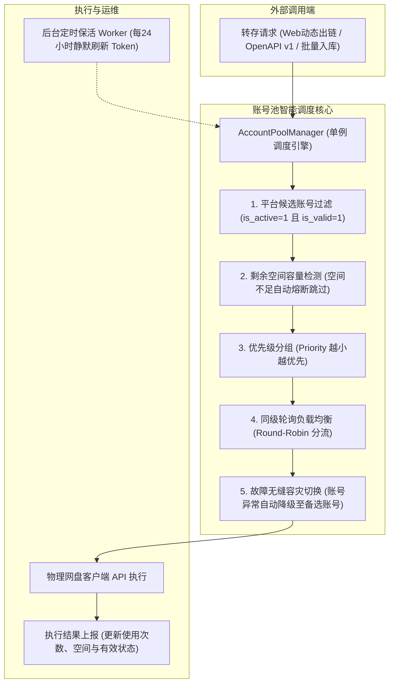

# 网盘多账号池（Account Pool）配置与使用指南

`pan-relay` 内置了企业级的**网盘多账号池智能调度中枢**（`AccountPoolManager`），彻底告别了传统单 Cookie 模式下的容量受限、高频风控、单点故障等问题。

---

## 🌟 核心特性与架构设计



### 1. 多账号优先级与加权轮询调度
* **Priority (优先级)**：数字越小优先级越高（默认 `1` 为最高优先级）。
* **同级轮询（Round-Robin）**：同一优先级下配置多个账号（如 夸克1号、夸克2号、夸克3号），系统将按轮询算法自动平摊每次转存请求，实现并发分流与规避单号风控。

### 2. 空间检测与自动容量熔断
* 系统维护各账号的 `total_space_bytes`、`used_space_bytes` 与 `left_space_bytes`。
* 当某账号剩余可用空间耗尽或不足以落盘时，调度器会自动将其临时跳过，调度同平台空间充裕的账号。

### 3. 故障自动转移（Failover）
* 当首选账号由于网络偶发波动、网盘官方临时风控或 Cookie 过期导致转存失败时，调度器会立即将其标记并**在当前请求中无感降级至候选备用账号**继续执行，保障上层 Web/API 调用 100% 成功。

### 4. 静默保活与 Token 自动续期
* 系统内置后台调度任务，每 24 小时定期对需要刷新 Token 的网盘（阿里云盘、迅雷网盘、光鸭云盘、移动云盘）执行静默自检与续期更新，无需人工介入。

---

## 🛠️ 各网盘账号凭据获取与配置指南

登录管理后台进入 **系统配置 → 网盘账号池**，点击右上角 **【+ 添加账号】** 即可为任意网盘添加多个独立账号。

### 1. 夸克网盘 (Quark)
* **凭证类型**：`Cookie`
* **获取方法**：
  1. 浏览器打开 [pan.quark.cn](https://pan.quark.cn/) 并登录账号。
  2. 按 `F12` 打开开发者工具，切换至 **网络 (Network)** 标签页。
  3. 刷新页面或点击任意文件夹，在请求头（Request Headers）中找到 `Cookie`。
  4. 复制完整的 Cookie 字符串（需包含 `_UP_A4A_11_` 或 `cookie_token` 相关字段）填入后台。

### 2. 百度网盘 (Baidu)
* **凭证类型**：`Cookie`
* **获取方法**：
  1. 浏览器访问 [pan.baidu.com](https://pan.baidu.com/) 登录。
  2. 开发者工具 Network 中找到任意接口请求（如 `list`），复制请求头中的完整 `Cookie`（包含 `BDUSS` 及 `STOKEN`）。

### 3. 阿里云盘 (Aliyun)
* **凭证类型**：`Refresh Token` (32位字符串)
* **获取方法**：
  1. 浏览器登录 [aliyundrive.com](https://www.aliyundrive.com/)。
  2. `F12` 开发者工具 -> **应用 (Application)** -> **本地存储 (Local Storage)**。
  3. 找到 `token` 键，展开 JSON 对象复制其中的 `refresh_token` 值。

### 4. UC 网盘 (UC)
* **凭证类型**：`Cookie`
* **获取方法**：
  1. 浏览器登录 [drive.uc.cn](https://drive.uc.cn/)。
  2. 开发者工具 Network 中复制任意请求的完整 `Cookie`。

### 5. 迅雷网盘 (Xunlei)
* **凭证类型**：`Refresh Token` / 客户端授权 JSON
* **获取方法（两种途径）**：
  * **途径 A（一键自动化提取，强烈推荐）**：在宿主机登录官方迅雷客户端后，在项目根目录下运行：
    ```bash
    python3 scripts/extract_xunlei_token.py
    ```
    脚本支持 Windows、macOS 和 Linux，会自动提取 `refresh_token`、`captcha_sign` 等必要签名参数并输出。
  * **途径 B（手动填入）**：直接在凭据输入框填入通过抓包获取的 `refresh_token`。

### 6. 光鸭云盘 (Guangya)
* **凭证类型**：`Access Token` / `Refresh Token`
* **获取方法**：
  1. 登录网页版，从接口请求标头提取 `Authorization: Bearer <token>` 或本地存储中的 Token。

### 7. 悟空网盘 (Wukong)
* **凭证类型**：`Cookie` / `Session Token`
* **获取方法**：
  1. 登录悟空网盘网页端，从开发者工具网络请求中复制完整 `Cookie`。

### 8. 移动云盘 (139 / Caiyun)
* **凭证类型**：`Authorization Token`
* **获取方法**：
  1. 浏览器打开 [yun.139.com](https://yun.139.com/) 登录。
  2. 开发者工具 Network 中查看请求头，复制 `Authorization` 字段内容（通常以 `Basic ` 或 `Bearer ` 开头）。

---

## 🧪 账号自检与故障排查

1. **单个账号在线测试**：在后台网盘账号池列表中，点击账号操作列中的 **【测试】** 按钮，系统会立即发起一次沙箱接口握手测试，并更新其有效状态及最新可用空间。
2. **全池一键保活**：点击列表顶部的 **【一键全量保活】** 按钮，系统会即时并发巡检所有已激活账号并自动续期凭证。
3. **禁用与隔离**：当某个账号由于欠费或官方风控被封禁时，可直接在后台将“启用开关”关闭，调度器将即时将其剔除出可用池，不影响其他正常账号。
