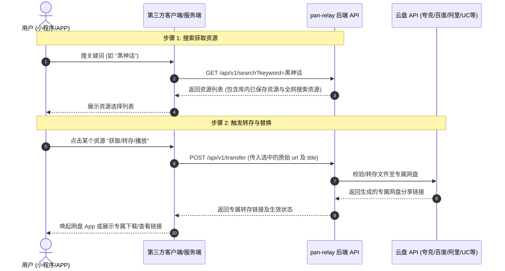

# pan-relay 开发者 REST API 接入指南 (v1)

本文档面向第三方应用（如微信小程序、APP、自定义 Web 客户端、Telegram 机器人等）开发者，提供基于 `pan-relay` 中转系统的标准化 API 接入规范。

---

## 核心设计理念：两步走接入架构 (Two-Step Relay Architecture)



---

## 全局环境变量与模式控制

系统支持在后台或环境变量中开启无头 API 模式 (`API_ONLY`)：

| 环境变量 | 可选值 | 说明 |
| :--- | :--- | :--- |
| `API_ONLY` / `PAN_RELAY_API_ONLY` | `1`, `true`, `0`, `false` | 开启后全面禁用前台 HTML UI，只保留纯 API 服务 |
| `ENABLE_FRONTEND` | `1`, `true`, `0`, `false` | 控制是否开放前台 Web 搜索界面 (`GET /`) |
| `ENABLE_ADMIN_UI` | `1`, `true`, `0`, `false` | 控制是否开放后台 Web 管理界面 (`/admin/*`) |

---

## 标准 API 节点列表 (`/api/v1`)

### 1. 服务健康状态与 API 概览

- **接口地址**: `GET /api/v1/status`
- **说明**: 检查后端服务是否可用，并获取当前开启的 API 模式。

**响应示例**:
```json
{
  "success": true,
  "service": "pan-relay",
  "version": "1.0.0",
  "status": "healthy",
  "api_mode": {
    "api_only": false,
    "enable_frontend": true,
    "enable_admin_ui": true
  }
}
```

---

### 2. 步骤 1: 聚合资源查询接口

- **接口地址**: `GET /api/v1/search`
- **请求参数**:
  - `keyword` (string, **必填**): 搜索关键词，例如 `黑神话`
  - `cloud_name` (string, **可选**): 指定筛选网盘类型，如 `夸克网盘`、`百度网盘`、`阿里云盘`、`UC网盘`、`迅雷网盘`
  - `limit` (int, **可选**): 限制最大返回结果条数，默认 `100`

**响应示例**:
```json
{
  "success": true,
  "total": 2,
  "results": [
    {
      "title": "黑神话：悟空 v1.0.8 官方中文版",
      "share_link": "https://pan.quark.cn/s/raw_public_link_123",
      "cloud_name": "夸克网盘",
      "password": "ABCD",
      "source": "plugin",
      "datetime": "2026-09-20 18:00:00"
    },
    {
      "title": "黑神话：悟空 高清原画合集",
      "share_link": "https://pan.quark.cn/s/already_relayed_link_888",
      "cloud_name": "夸克网盘",
      "password": "",
      "source": "hot",
      "datetime": "2026-09-20 19:30:00"
    }
  ]
}
```

*注：若要实现打字机效果的实时推送，可使用 SSE 流式接口 `GET /api/v1/search/stream?keyword=黑神话`*

---

### 3. 步骤 2: 资源转存与替换接口

- **接口地址**: `POST /api/v1/transfer`
- **请求 Content-Type**: `application/json`
- **请求参数**:
  - `url` (string, **必填**): 步骤 1 获取到的原始网盘链接 (`share_link`)
  - `title` (string, **可选**): 资源标题，默认 `未命名资源`
  - `netdisk_name` (string, **可选**): 网盘类型，如 `夸克网盘`

**请求示例**:
```json
{
  "url": "https://pan.quark.cn/s/raw_public_link_123",
  "title": "黑神话：悟空 v1.0.8 官方中文版",
  "netdisk_name": "夸克网盘"
}
```

**响应示例**:
```json
{
  "success": true,
  "message": "资源转换与链接生成成功",
  "data": {
    "url": "https://pan.quark.cn/s/my_relay_link_999",
    "mode": "temp_share",
    "netdisk_name": "夸克网盘"
  }
}
```

---

### 4. 网盘链接测活接口

- **接口地址**: `POST /api/v1/link/check`
- **单条测活请求**:
```json
{
  "url": "https://pan.quark.cn/s/xxx",
  "password": "ABCD",
  "disk_type": "夸克网盘"
}
```
- **批量测活请求**:
```json
{
  "items": [
    {"url": "https://pan.quark.cn/s/xxx1", "password": ""},
    {"url": "https://pan.quark.cn/s/xxx2", "password": "1234"}
  ]
}
```

---

### 5. 查询本地资源库

- **接口地址**: `GET /api/v1/resources`
- **请求参数**:
  - `page` (int, 默认 1): 当前页码
  - `page_size` (int, 默认 10): 每页数量
  - `search` (string): 筛选关键词

**响应示例**:
```json
{
  "success": true,
  "data": {
    "items": [...],
    "page": 1,
    "page_size": 10,
    "total": 42
  }
}
```
