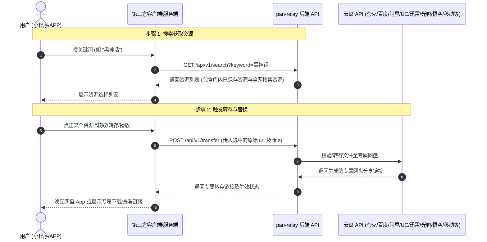

# pan-relay 开发者 REST API 接入指南 (v1)

本文档面向第三方应用（如微信小程序、APP、自定义 Web 客户端、Telegram 机器人等）开发者，提供基于 `pan-relay` 中转系统的标准化 API 接入规范。

---

## 核心设计理念：两步走接入架构 (Two-Step Relay Architecture)



---

## 全局服务通道与 UI 控制

系统支持在管理后台（**系统设置 → API 与通道配置**）中独立控制服务通道与 UI 开关：

| 配置项 | 可选值 | 说明 |
| :--- | :--- | :--- |
| **前台搜索开关** | 开启 / 关闭 | 控制是否开放前台 Web 搜索界面 (关闭时访问根路径 `GET /` 自动重定向至后台管理登录页面 `/login`) |
| **API 默认搜索作用域** | `own`, `all` | API 搜索默认检索作用域 (`own`: 仅站长收益库 / `all`: 全网并发) |
| **转存 API 鉴权密钥** | 字符串 / 留空 | API 转存鉴权密钥 (留空表示公开，设置后客户端请求需携带 `X-API-Key` 或 Bearer Token) |

---

## 标准 API 节点列表 (`/api/v1`)

### 1. 服务健康状态与 API 概览

- **接口地址**: `GET /api/v1/status`
- **说明**: 检查后端服务是否可用，并获取当前开启的服务模式及可用端点。

**响应示例**:
```json
{
  "success": true,
  "service": "pan-relay",
  "version": "1.0.0",
  "status": "healthy",
  "api_mode": {
    "api_only": false,
    "enable_frontend": true,
    "search_scope": "all",
    "transfer_api_key": ""
  },
  "endpoints": {
    "status": "/api/v1/status",
    "search": "/api/v1/search",
    "search_stream": "/api/v1/search/stream",
    "transfer": "/api/v1/transfer",
    "link_check": "/api/v1/link/check",
    "resources": "/api/v1/resources",
    "docs": "/api/v1/docs"
  }
}
```

---

### 2. 步骤 1: 聚合资源查询接口

- **接口地址**: `GET /api/v1/search`
- **请求参数**:
  - `keyword` (string, **必填**): 搜索关键词，例如 `黑神话`
  - `cloud_name` / `cloud_names` (string, **可选**): 指定筛选网盘类型，支持全称或常见简称/别名（如 `百度`、`阿里`、`夸克`、`quark`、`115`、`123`、`uc`、`google`、`磁力` 等），支持单个网盘、逗号分隔多个网盘，如 `夸克,百度` 或多值参数 `cloud_name=夸克&cloud_name=阿里`
  - `limit` (int, **可选**): 限制最大返回结果条数，默认 `100`
  - `scope` (string, **可选**): 查询作用域 (`own` 仅自有库, `all` 全网聚合，默认按后台配置)
  - `check_status` (bool, **可选**): 是否对搜索结果实时测活，默认 `false`。开启后每条结果将注入 `health_state` (`ok` / `bad` / `locked` / `uncertain`) 与 `health_summary`、`file_count`
  - `filter_bad` (bool, **可选**): 是否自动在服务端剔除已失效、违规或空文件的链接，默认 `false`

**响应示例 (开启 `check_status=true`)**:
```json
{
  "success": true,
  "scope": "all",
  "total": 2,
  "results": [
    {
      "title": "黑神话：悟空 v1.0.8 官方中文版",
      "share_link": "https://pan.quark.cn/s/raw_public_link_123",
      "cloud_name": "夸克网盘",
      "password": "",
      "source": "plugin",
      "health_state": "ok",
      "health_summary": "链接有效",
      "file_count": 5
    },
    {
      "title": "黑神话：悟空 高清原画合集",
      "share_link": "https://pan.quark.cn/s/already_relayed_link_888",
      "cloud_name": "夸克网盘",
      "password": "",
      "source": "hot",
      "health_state": "ok",
      "health_summary": "链接有效",
      "file_count": 1
    }
  ]
}
```

---

### 3. 步骤 1 (流式): SSE 实时流式搜索接口

- **接口地址**: `GET /api/v1/search/stream`
- **请求参数**:
  - `keyword` (string, **必填**): 搜索关键词，例如 `黑神话`
- **说明**: 返回 `text/event-stream` 格式的 Server-Sent Events，支持前端/小程序实现打字机式流式加载。
- **事件结构**:
  ```text
  data: {"type": "start", "keyword": "黑神话"}

  data: {"type": "item", "data": {"title": "黑神话：悟空", "share_link": "...", "cloud_name": "夸克网盘", "source": "db"}}

  data: {"type": "done", "total": 12}
  ```

---

### 4. 步骤 2: 资源转存与替换接口 (内置测活防护)

- **接口地址**: `POST /api/v1/transfer`
- **请求 Content-Type**: `application/json`
- **请求头鉴权**:
  - `X-API-Key`: `<YOUR_API_KEY>` (推荐)
  - `Authorization: Bearer <YOUR_API_KEY>`
- **请求参数**:
  - `url` (string, **必填**): 步骤 1 获取到的原始网盘链接 (`share_link`)
  - `title` (string, **可选**): 资源标题，默认 `未命名资源`
  - `netdisk_name` (string, **可选**): 网盘类型，如 `夸克网盘`（留空则智能推断）
  - `password` (string, **可选**): 原始链接提取码 (若有)
  - `skip_check` (bool, **可选**): 是否跳过前置免登录测活检查，默认 `false`。保持 false 时，系统自动核验链接有效性与非空状态，异常时返回 HTTP 422 拦截拒绝转存
  - `api_key` (string, **可选**): 鉴权密钥 (当无法自定义 Header 时的 fallback)

**请求示例**:
```json
{
  "url": "https://pan.quark.cn/s/raw_public_link_123",
  "title": "黑神话：悟空 v1.0.8 官方中文版",
  "netdisk_name": "夸克网盘"
}
```

**成功响应示例**:
```json
{
  "success": true,
  "message": "资源转换与链接生成成功",
  "data": {
    "url": "https://pan.quark.cn/s/my_relay_link_999",
    "mode": "temp_share",
    "netdisk_name": "夸克网盘"
  }
}
```

**失败响应示例 (HTTP 422 拦截失效或空链接)**:
```json
{
  "success": false,
  "code": "LINK_INVALID",
  "message": "源链接已失效、被下架或内容为空: 分享链接无效：文件列表为空",
  "data": {
    "url": "https://pan.quark.cn/s/raw_public_link_123",
    "state": "bad",
    "summary": "分享链接无效：文件列表为空",
    "disk_type": "夸克网盘"
  }
}
```

**失败响应示例 (HTTP 422 缺少提取码)**:
```json
{
  "success": false,
  "code": "LINK_LOCKED",
  "message": "源链接需要提取码，请在请求体中提供 password 参数",
  "data": {
    "url": "https://pan.quark.cn/s/locked_link",
    "state": "locked",
    "summary": "需要提取码",
    "disk_type": "夸克网盘"
  }
}
```

---

### 5. 网盘链接免登录测活接口

- **接口地址**: `POST /api/v1/link/check`
- **说明**: 原生免登录探测 12 大网盘（夸克、百度、阿里、UC、迅雷、123盘、天翼、115、移动云盘、联通云盘、悟空网盘、光鸭云盘），实时返回有效性、提取码要求及文件数量。

**单条测活请求**:
```json
{
  "url": "https://pan.quark.cn/s/raw_public_link_123",
  "password": "ABCD",
  "disk_type": "夸克网盘",
  "refresh": false
}
```

**单条测活响应**:
```json
{
  "success": true,
  "mode": "single",
  "data": {
    "url": "https://pan.quark.cn/s/raw_public_link_123",
    "state": "ok",
    "summary": "链接有效",
    "file_count": 5,
    "disk_type": "夸克网盘",
    "requires_pwd": false
  }
}
```

**批量测活请求**:
```json
{
  "items": [
    {"url": "https://pan.quark.cn/s/xxx1", "password": ""},
    {"url": "https://pan.quark.cn/s/xxx2", "password": "1234"}
  ]
}
```

**批量测活响应**:
```json
{
  "success": true,
  "mode": "batch",
  "total": 2,
  "results": [
    {
      "url": "https://pan.quark.cn/s/xxx1",
      "state": "ok",
      "summary": "链接有效",
      "file_count": 3,
      "disk_type": "夸克网盘"
    },
    {
      "url": "https://pan.quark.cn/s/xxx2",
      "state": "locked",
      "summary": "需要提取码",
      "file_count": 0,
      "disk_type": "夸克网盘"
    }
  ]
}
```

---

### 6. 查询本地收益资源库

- **接口地址**: `GET /api/v1/resources`
- **请求参数**:
  - `page` (int, 默认 1): 当前页码
  - `page_size` (int, 默认 10): 每页数量
  - `search` (string, 可选): 标题或链接关键字筛选

**响应示例**:
```json
{
  "success": true,
  "data": {
    "items": [
      {
        "id": 1,
        "title": "黑神话：悟空 高清原画",
        "cloud_name": "夸克网盘",
        "share_link": "https://pan.quark.cn/s/my_relay_link_123",
        "password": "",
        "created_at": "2026-09-23 00:00:00"
      }
    ],
    "page": 1,
    "page_size": 10,
    "total": 1
  }
}
```

---

### 7. 开发者 API 规范与文档接口

- **接口地址**: `GET /api/v1/docs`
- **说明**: 浏览器访问直接展示交互式开发者文档 UI；当请求头携带 `Accept: application/json` 或传参 `?format=json` 时返回 JSON 格式的 OpenAPI 规范元数据。
